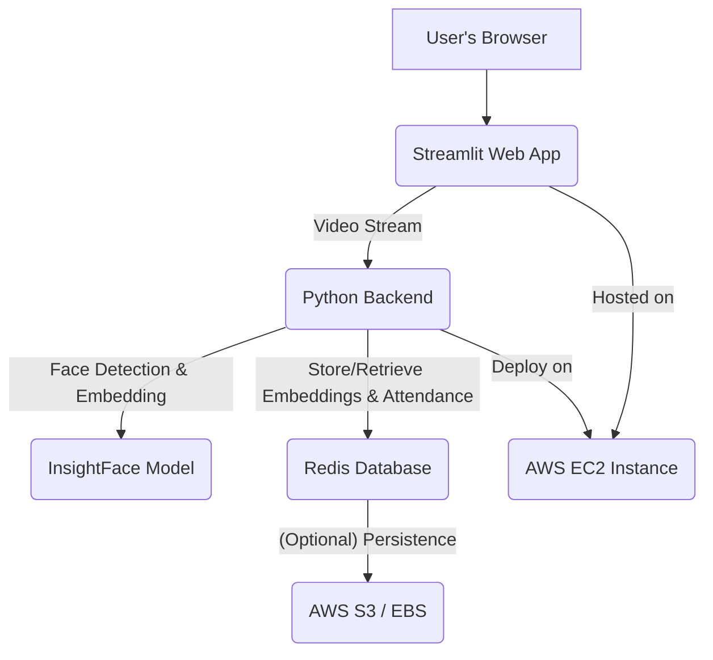

Face Recognition Attendance System

[](https://www.python.org/)
[](https://opencv.org/)
[](https://streamlit.io/)
[](https://github.com/deepinsight/insightface)
[](https://redis.io/)
[](https://aws.amazon.com/)
[](https://www.google.com/search?q=LICENSE)

## Table of Contents

  - [About the Project](https://www.google.com/search?q=%23about-the-project)
  - [Features](https://www.google.com/search?q=%23features)
  - [Technologies Used](https://www.google.com/search?q=%23technologies-used)
  - [Architecture](https://www.google.com/search?q=%23architecture)
  - [Getting Started](https://www.google.com/search?q=%23getting-started)
      - [Prerequisites](https://www.google.com/search?q=%23prerequisites)
      - [Installation](https://www.google.com/search?q=%23installation)
      - [Configuration](https://www.google.com/search?q=%23configuration)
      - [Running the Application](https://www.google.com/search?q=%23running-the-application)
  - [Usage](https://www.google.com/search?q=%23usage)
  - [Deployment on AWS](https://www.google.com/search?q=%23deployment-on-aws)
  - [Future Enhancements](https://www.google.com/search?q=%23future-enhancements)
  - [Contributing](https://www.google.com/search?q=%23contributing)
  - [License](https://www.google.com/search?q=%23license)
  - [Contact](https://www.google.com/search?q=%23contact)
  - [Acknowledgements](https://www.google.com/search?q=%23acknowledgements)

## About the Project

This project implements a robust and scalable **Face Recognition Attendance System** designed to automate attendance tracking using cutting-edge computer vision techniques. Leveraging a combination of Python libraries and cloud services, this system provides a user-friendly interface for managing student/employee records and accurately marking attendance in real-time.

The system aims to address the shortcomings of traditional attendance methods by offering:

  - **Accuracy:** High precision in face detection and recognition.
  - **Efficiency:** Real-time processing for quick attendance marking.
  - **Scalability:** Built to handle a growing number of users and data.
  - **Ease of Use:** An intuitive web interface for administration and live attendance.

## Features

  - **Real-time Face Detection & Recognition:** Utilizes camera input to detect faces and match them against a registered database.
  - **User Registration:** Securely register new individuals with their facial embeddings.
  - **Attendance Logging:** Automatically records attendance with timestamps upon successful recognition.
  - **Dashboard & Reporting:** View attendance logs, generate reports, and manage user data through a Streamlit web interface.
  - **Robust Face Embedding:** Employs InsightFace for highly accurate and robust facial feature extraction.
  - **Scalable Data Storage:** Uses Redis for efficient storage and retrieval of facial embeddings and attendance records.
  - **Cloud Deployment Ready:** Designed for seamless deployment and operation on Amazon Web Services (AWS) infrastructure.

## Technologies Used

  * **Python 3.9+**: The core programming language for the entire system.
  * **OpenCV**: For real-time video capture, image processing, and face detection.
  * **Streamlit**: To build the interactive and user-friendly web interface for the attendance system.
  * **InsightFace**: A powerful open-source deep learning library for state-of-the-art face recognition and detection. Specifically, it's used for generating high-quality face embeddings.
  * **Redis**: An in-memory data store used as a high-performance database for storing facial embeddings and attendance records, enabling quick lookups.
  * **AWS (Amazon Web Services)**: For cloud infrastructure, potentially including:
      * **EC2**: To host the Streamlit application and backend services.
      * **S3**: For storing images of registered users or other static assets.
      * **IAM**: For managing user permissions and access control.
      * *(Optional: RDS for a relational database, Lambda for serverless functions, etc., depending on future complexity)*
  * **`numpy`**: For numerical operations, especially with face embeddings.
  * **`scipy`**: For distance calculations (e.g., cosine similarity) between face embeddings.
  * **`python-dotenv`**: For managing environment variables securely.

## Architecture

The system follows a client-server architecture:

1.  **Client (Streamlit Web App):**

      * Provides the user interface for registration, live attendance monitoring, and attendance reporting.
      * Captures live video feed from the webcam.
      * Sends video frames to the backend for processing.

2.  **Backend (Python/OpenCV/InsightFace):**

      * Receives video frames from the Streamlit app.
      * Uses OpenCV to detect faces in the frames.
      * Leverages InsightFace to extract high-dimensional facial embeddings for detected faces.
      * Compares extracted embeddings with stored embeddings in Redis for recognition.
      * If a match is found, updates attendance records in Redis.

3.  **Database (Redis):**

      * Stores registered user information, including their names, IDs, and the corresponding InsightFace embeddings.
      * Maintains real-time attendance logs.

4.  **Cloud Infrastructure (AWS):**

      * Provides the computing resources (EC2) to run the Streamlit application and backend.
      * Offers scalable storage (S3) for auxiliary data.

<!-- end list -->



## Getting Started

Follow these steps to get your Face Recognition Attendance System up and running locally.

### Prerequisites

  * Python 3.9+ installed.
  * `pip` (Python package installer).
  * Access to a webcam for live attendance.
  * A running Redis instance (local or remote).
  * AWS account (if deploying to AWS).

### Installation

1.  **Clone the repository:**

    ```bash
    git clone [Your Repository Link]
    cd [your-project-name]
    ```

2.  **Create and activate a virtual environment:**

    ```bash
    python -m venv venv
    # On Windows
    .\venv\Scripts\activate
    # On macOS/Linux
    source venv/bin/activate
    ```

3.  **Install the required Python packages:**

    ```bash
    pip install -r requirements.txt
    ```

    (Ensure your `requirements.txt` includes: `streamlit`, `opencv-python`, `insightface`, `redis`, `numpy`, `scipy`, `python-dotenv`)

### Configuration

1.  **Redis Setup:**

      * Ensure your Redis server is running.
      * Update the Redis connection details in your configuration (e.g., `config.py` or `.env` file).

2.  **Environment Variables:**
    Create a `.env` file in the root directory of your project to store sensitive information and configurations:

    ```
    REDIS_HOST=localhost
    REDIS_PORT=6379
    REDIS_DB=0
    # Add any AWS specific credentials if needed for S3 etc. (handle with care!)
    # AWS_ACCESS_KEY_ID=YOUR_AWS_ACCESS_KEY_ID
    # AWS_SECRET_ACCESS_KEY=YOUR_AWS_SECRET_ACCESS_KEY
    ```

### Running the Application

1.  **Start the Redis server** (if not already running).

2.  **Run the Streamlit application:**

    ```bash
    streamlit run app.py
    ```

    (Assuming `app.py` is your main Streamlit application file).

    This will open the application in your default web browser.

## Usage

1.  **Access the Application:** Open the URL provided by Streamlit (usually `http://localhost:8501`).
2.  **Register New Users:**
      * Navigate to the "Register User" section.
      * Enter the user's Name and ID.
      * Use the webcam to capture images for face registration. Ensure good lighting and different angles.
      * The system will extract and store the facial embedding in Redis.
3.  **Take Attendance:**
      * Go to the "Take Attendance" section.
      * The webcam will activate, and the system will start detecting and recognizing faces in real-time.
      * Upon successful recognition, attendance will be automatically marked for the recognized individual.
4.  **View Attendance Records:**
      * Visit the "Attendance Records" section to view daily or historical attendance data.
      * You can filter by date, user, etc.

## Deployment on AWS

This project is designed with AWS deployment in mind, offering scalability and reliability.

1.  **Launch an EC2 Instance:**
      * Choose an appropriate EC2 instance type (e.g., `t2.medium` or `t3.medium` for moderate usage).
      * Select an Amazon Machine Image (AMI) with Python pre-installed or install it manually.
2.  **Install Dependencies:**
      * SSH into your EC2 instance.
      * Clone your repository.
      * Install Python, `pip`, and all project dependencies (`pip install -r requirements.txt`).
      * Install OpenCV dependencies if necessary (e.g., `sudo apt-get install libgl1-mesa-glx`).
3.  **Set up Redis:**
      * You can run Redis on the same EC2 instance or use Amazon ElastiCache for a managed Redis service.
4.  **Configure Security Groups:**
      * Open inbound rules for the Streamlit port (default 8501) to allow access from the internet (or specific IPs).
      * Ensure Redis port (default 6379) is only accessible from your EC2 instance.
5.  **Run the Streamlit App:**
      * Use `nohup streamlit run app.py --server.port 8501 --server.enableCORS false &` to run the app in the background.
6.  **Domain Mapping (Optional):**
      * Configure Route 53 to map a custom domain name to your EC2 instance's public IP.

## Future Enhancements

  * **Liveness Detection:** Implement anti-spoofing techniques to prevent attendance fraud using photos or videos.
  * **Multi-camera Support:** Extend to support multiple camera feeds for larger areas.
  * **User Roles & Permissions:** Implement different access levels (admin, regular user).
  * **Reporting & Analytics:** More advanced attendance reports, charts, and data visualization.
  * **Database Migration:** Option to use a relational database like PostgreSQL (AWS RDS) for more complex queries and data integrity.
  * **Notification System:** Send alerts for unrecognized faces or late arrivals.
  * **Containerization:** Dockerize the application for easier deployment and portability.
  * **CI/CD Pipeline:** Automate testing and deployment using AWS CodePipeline or GitHub Actions.

## Contributing

Contributions are welcome\! If you have any suggestions, bug fixes, or new features to add, please follow these steps:

1.  Fork the repository.
2.  Create a new branch (`git checkout -b feature/AmazingFeature`).
3.  Commit your changes (`git commit -m 'Add some AmazingFeature'`).
4.  Push to the branch (`git push origin feature/AmazingFeature`).
5.  Open a Pull Request.

## License

Distributed under the MIT License. See `LICENSE` for more information.

## Contact

[Your Name/Organization Name] - [Your Email Address]
Project Link: [Your Repository Link]

## Acknowledgements

  * [OpenCV](https://opencv.org/)
  * [Streamlit](https://streamlit.io/)
  * [InsightFace](https://github.com/deepinsight/insightface)
  * [Redis](https://redis.io/)
  * [AWS](https://aws.amazon.com/)
